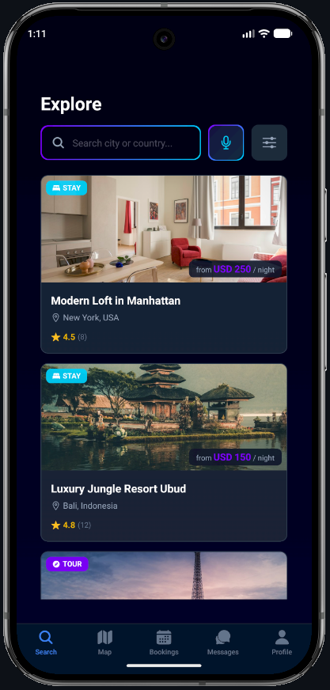
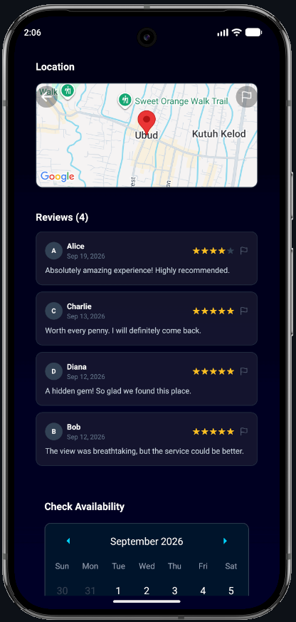
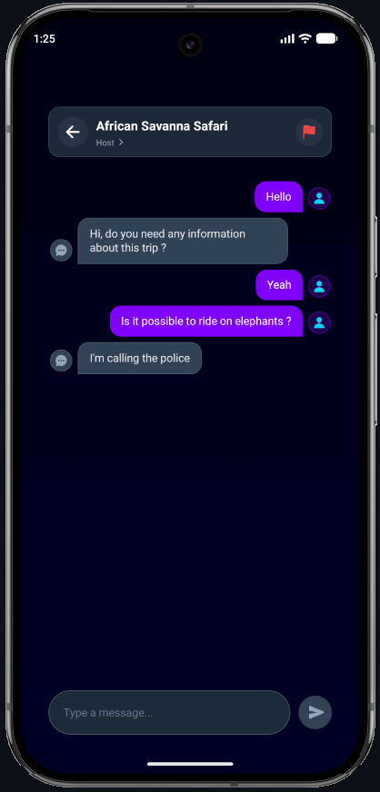

# 🌍 Voya

<p align="center">
  
  &nbsp;&nbsp;&nbsp;&nbsp;
  
  &nbsp;&nbsp;&nbsp;&nbsp;
  
</p>

Voya to nowoczesna aplikacja mobilna do inteligentnego wyszukiwania, rezerwacji i oceniania noclegów oraz atrakcji turystycznych. Łączy intuicyjny, neonowy interfejs z zaawansowanymi funkcjami, takimi jak wyszukiwanie głosowe, interaktywne mapy oraz asystent AI wspierający moderację treści i automatyczne tworzenie ofert.

Projekt oparty jest na **architekturze bezserwerowej (Serverless)** wykorzystującej usługi chmurowe **Firebase**, co eliminuje konieczność utrzymywania tradycyjnego serwera backendowego i zapewnia natychmiastową synchronizację danych w czasie rzeczywistym.

---

## 💻 Wykorzystane technologie

Aplikacja wykorzystuje nowoczesny stos technologiczny oparty na ekosystemie React Native oraz chmurze Google Firebase:

### 📱 Frontend (Aplikacja Mobilna)
- **Framework:** React Native / Expo (SDK 54) z włączoną nową architekturą (New Architecture)
- **Język:** TypeScript
- **Nawigacja:** Expo Router (File-based Routing, Stack & Tabs)
- **Style & UI:** NativeWind v4 (TailwindCSS) – dynamiczne gradienty, ciemny motyw oraz tryb wysokiego kontrastu
- **Komponenty i Animacje:** React Native Reanimated, React Native Gesture Handler, Expo Image, React Native Calendars

### ☁️ Backend & Baza Danych (Architektura Serverless)
Rdzeń danych i logiki aplikacji oparty jest w całości na chmurze Firebase:

- **🔐 Firebase Authentication** – bezpieczne uwierzytelnianie użytkowników, rejestracja i logowanie (Email/Password).
- **🗄️ Cloud Firestore** – dokumentowa baza danych NoSQL czasu rzeczywistego (przechowywanie ofert, rezerwacji, profili i czatów) z subskrypcjami zmian (`onSnapshot`).
- **📦 Firebase Storage** – bezpieczny magazyn obiektowy na zdjęcia obiektów noclegowych, wycieczek oraz awatary użytkowników.
- **⚡ Serverless Architecture** – brak klasycznego monolitycznego serwera; komunikacja bezpośrednia z usługami chmurowymi z zachowaniem reguł bezpieczeństwa (Security Rules).

### 🤖 Zewnętrzne API (Integracje)
- **🧠 Groq API (Llama-3-70b-versatile)** – zaawansowany model językowy (LLM) zintegrowany z aplikacją:
  - **Generowanie opisów:** Automatyczne tworzenie atrakcyjnych opisów ofert na podstawie tytułu, kategorii i udogodnień.
  - **AI Safety Check:** Automatyczna moderacja treści wprowadzanych przez użytkowników pod kątem bezpieczeństwa, przemocy i mowy nienawiści.
- **🗺️ Google Maps SDK for Android (React Native Maps)** – natywne kafelki mapy, geolokalizacja (Expo Location) oraz wyszukiwanie przestrzenne oparte na geohash (`geofire-common`).
- **🎙️ Expo Speech Recognition** – obsługa wyszukiwania głosowego ofert w czasie rzeczywistym.

### ♿ Dostępność i Bezpieczeństwo
- **Dostępność (a11y):** Dedykowany tryb wysokiego kontrastu (High Contrast Mode) ze specjalnym stylem mapy, powiększone elementy interaktywne oraz pełne wsparcie dla czytników ekranowych.
- **Bezpieczeństwo i role:** Ścisła kontrola uprawnień oparta na trzech rolach użytkowników (Turysta, Usługodawca, Administrator).

---

## 🏗️ Moduły i Struktura Aplikacji

1. **`app/(auth)`** – Moduł uwierzytelniania: logowanie, rejestracja, reset hasła oraz proces konfiguracji profilu z wyborem roli (Turysta / Usługodawca).
2. **`app/(tourist)`** – Panel turysty: eksploracja ofert (noclegi, wycieczki), wyszukiwarka głosowa, interaktywna mapa z markerami, podgląd szczegółów, opinie, kalendarz i rezerwacje.
3. **`app/(provider)`** – Panel dostawcy usług: zarządzanie własnymi ofertami, dodawanie noclegów i wycieczek z asystentem AI, podgląd przychodzących rezerwacji.
4. **`app/(admin)`** – Panel administratora: weryfikacja i akceptacja nowo dodanych obiektów, moderacja zgłoszeń oraz wbudowany **Seeder bazy danych**.
5. **`app/chat` & `app/chats`** – Czat w czasie rzeczywistym pomiędzy turystą a gospodarzem/przewodnikiem powiązany z daną rezerwacją lub ofertą.
6. **`services/`** – Warstwa serwisowa: integracja z LLM Groq (`ai.ts`), powiadomienia wewnątrz aplikacji (`notifications.ts`) oraz generator danych testowych (`seeder.ts`).

---

## 🚀 Uruchomienie projektu lokalnie (Localhost / Emulator)

Aby uruchomić aplikację w środowisku deweloperskim, upewnij się, że masz zainstalowany **Node.js** (v20+) oraz skonfigurowany emulator Androida (np. przez **Android Studio**).

### 1. Instalacja zależności
Przejdź do katalogu aplikacji i zainstaluj pakiety:
```bash
cd frontend
npm install
```

### 2. Konfiguracja zmiennych środowiskowych (.env)
W katalogu `frontend` utwórz plik `.env` (lub zaktualizuj istniejący) z kluczami API:
```env
EXPO_PUBLIC_GROQ_API_KEY=twoj_klucz_groq_api
GOOGLE_MAPS_API_KEY=twoj_klucz_google_maps_sdk_android
```

### 3. Konfiguracja Firebase
1. W [Firebase Console](https://console.firebase.google.com/) utwórz projekt i dodaj aplikację Android z nazwą pakietu: **`com.mm.voyaapp`**.
2. Pobierz plik **`google-services.json`** i umieść go w katalogu `frontend/`.
3. Włącz usługi: **Authentication** (Email/Password), **Cloud Firestore** oraz **Firebase Storage**.

### 4. Uruchomienie emulatora Androida
Uruchom emulator z poziomu Android Studio lub za pomocą wiersza poleceń:
```powershell
& "C:\Users\makky\AppData\Local\Android\Sdk\emulator\emulator.exe" -avd Pixel_9_Pro
```

### 5. Zbudowanie i start aplikacji
Uruchom budowanie deweloperskiego buildu natywnego:
```bash
cd frontend
npx expo run:android
```
> *Uwaga: Ponieważ projekt korzysta z natywnych bibliotek `@react-native-firebase/*` oraz Google Maps, wymagany jest development build (`npx expo run:android`), a nie standardowe Expo Go.*

### 6. Zasilenie bazy danymi testowymi (Seeder)
1. W uruchomionej aplikacji zarejestruj nowe konto.
2. W Firebase Console przejdź do bazy **Firestore** ➔ kolekcja `users` ➔ odszukaj swoje konto i zmień wartość pola `role` na `"ADMIN"`.
3. Zrestartuj aplikację lub zaloguj się ponownie – zostaniesz przekierowany do panelu administratora.
4. Przejdź do zakładki **Profile**, w sekcji **Developer Area** kliknij przycisk **"Seed Database"** i potwierdź zasilenie danymi.